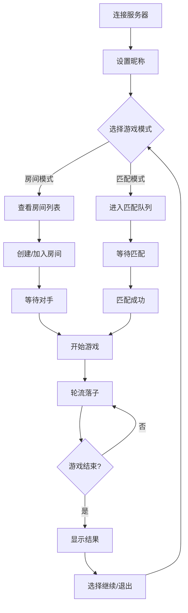

# 五子棋在线游戏产品需求文档

## 1. Product Overview

基于Java的命令行在线五子棋游戏，支持多人实时对战、房间管理和智能匹配系统。

该产品解决了传统五子棋游戏缺乏在线对战功能的问题，为棋类爱好者提供便捷的网络对战平台，通过房间系统和匹配机制提升用户游戏体验。

目标是打造稳定可靠的在线棋类游戏平台，支持并发用户对战，具备完善的游戏规则校验和用户管理功能。

## 2. Core Features

### 2.1 User Roles

| Role | Registration Method | Core Permissions |
|------|---------------------|------------------|
| 游戏玩家 | 直接连接服务器 | 可创建/加入房间、进行游戏对战、查看房间列表 |

### 2.2 Feature Module

我们的五子棋在线游戏需求包含以下主要功能模块：

1. **连接管理页面**：服务器连接、用户身份验证、连接状态显示
2. **房间管理页面**：房间创建、房间列表查看、房间加入/退出
3. **匹配系统页面**：自动匹配、匹配队列管理、匹配状态显示
4. **游戏对战页面**：棋盘显示、落子操作、游戏状态管理、轮次控制
5. **命令交互页面**：命令输入、帮助信息、错误提示

### 2.3 Page Details

| Page Name | Module Name | Feature description |
|-----------|-------------|---------------------|
| 连接管理页面 | 服务器连接 | 建立TCP连接到游戏服务器，处理连接异常和重连机制 |
| 连接管理页面 | 用户认证 | 设置玩家昵称，验证用户身份，管理会话状态 |
| 房间管理页面 | 房间创建 | 创建新游戏房间，设置房间参数，分配房间ID |
| 房间管理页面 | 房间列表 | 显示所有可用房间，包含房间ID、玩家数量、游戏状态 |
| 房间管理页面 | 房间操作 | 加入指定房间、退出当前房间、房间状态同步 |
| 匹配系统页面 | 自动匹配 | 智能匹配等待中的玩家，创建匹配房间，开始游戏 |
| 匹配系统页面 | 匹配队列 | 管理匹配等待队列，显示匹配进度，取消匹配 |
| 游戏对战页面 | 棋盘显示 | 渲染15x15棋盘，显示黑白棋子，坐标标识（十六进制A-E） |
| 游戏对战页面 | 落子操作 | 接受十六进制坐标输入（支持0xA格式），验证落子有效性，更新棋盘状态 |
| 游戏对战页面 | 轮次控制 | 严格执行黑先白后规则，轮流落子校验，防止连续落子 |
| 游戏对战页面 | 胜负判断 | 检测五子连珠（横纵斜八方向），游戏结束处理，胜负结果通知 |
| 游戏对战页面 | 断线处理 | 检测玩家断线，60秒重连等待，超时判负处理 |
| 命令交互页面 | 命令解析 | 解析用户输入命令，参数校验，命令路由分发 |
| 命令交互页面 | 帮助系统 | 提供help命令，显示可用命令列表，命令使用说明 |
| 命令交互页面 | 错误提示 | 详细的错误信息反馈，命令格式提示，用户引导 |

## 3. Core Process

### 主要用户操作流程

**房间对战流程：**
1. 玩家连接服务器并设置昵称
2. 查看房间列表或创建新房间
3. 加入房间等待对手或邀请其他玩家
4. 房间满员后开始游戏，系统随机分配黑白方
5. 按轮次进行落子，系统校验每步操作
6. 游戏结束后显示结果，玩家可选择继续或退出

**匹配对战流程：**
1. 玩家连接服务器并设置昵称
2. 点击匹配按钮进入匹配队列
3. 系统自动匹配合适的对手
4. 匹配成功后自动创建房间并开始游戏
5. 游戏流程同房间对战

**断线重连流程：**
1. 检测到玩家断线，游戏暂停
2. 通知对手等待重连，启动60秒倒计时
3. 断线玩家重连后恢复游戏状态
4. 超时未重连则判定断线方失败

## 4. User Interface Design

### 4.1 Design Style

- **主色调**：黑色(#000000)和白色(#FFFFFF)，体现棋类游戏的经典配色
- **辅助色**：深灰色(#333333)用于边框，浅灰色(#CCCCCC)用于背景
- **字体风格**：等宽字体，确保棋盘对齐，字号12-14px
- **布局风格**：命令行界面，简洁明了的文本布局
- **交互风格**：基于文本命令的交互方式，支持快捷命令

### 4.2 Page Design Overview

| Page Name | Module Name | UI Elements |
|-----------|-------------|-------------|
| 连接管理页面 | 服务器连接 | 连接状态提示文本，服务器地址显示，连接进度指示 |
| 房间管理页面 | 房间列表 | 表格形式显示房间信息，包含房间ID、玩家数、状态列 |
| 游戏对战页面 | 棋盘显示 | 15x15字符网格，●表示黑子，○表示白子，坐标标识0-E |
| 游戏对战页面 | 轮次提示 | 当前轮次文本提示，玩家颜色标识，倒计时显示 |
| 命令交互页面 | 命令输入 | 命令提示符">"，输入区域，历史命令回显 |
| 命令交互页面 | 帮助信息 | 分类命令列表，使用示例，参数说明 |

### 4.3 Responsiveness

该产品为命令行应用，主要面向桌面环境，不涉及响应式设计。界面采用固定宽度布局，确保棋盘显示的一致性和可读性。支持不同终端窗口大小的适配，最小推荐窗口尺寸为80x25字符。