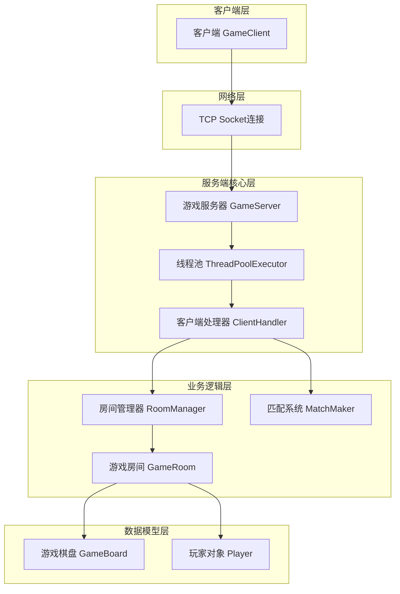
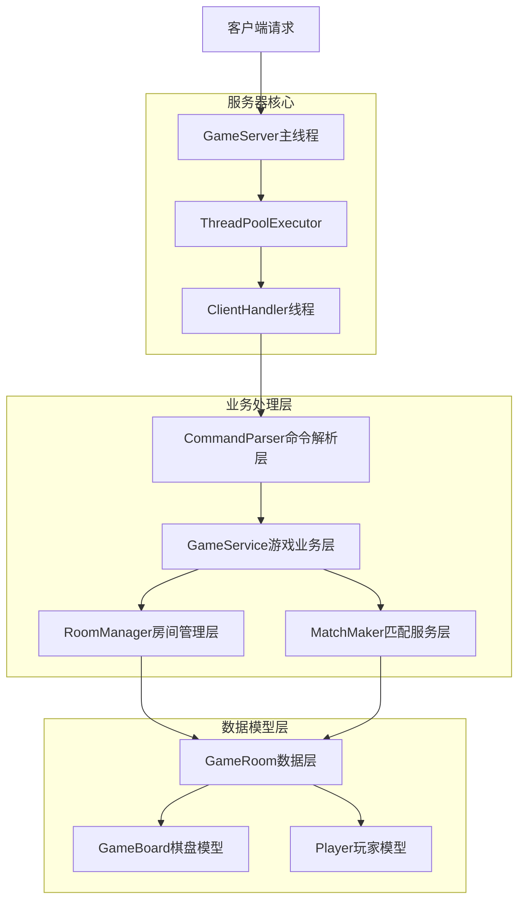
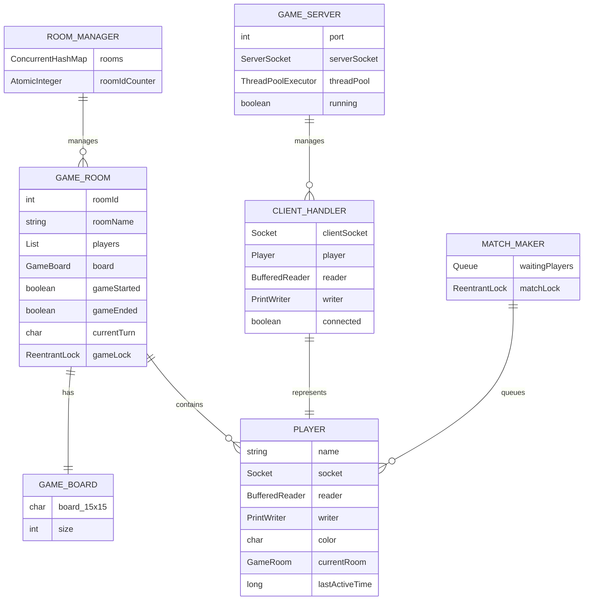

# 五子棋在线游戏技术架构文档

## 1. Architecture design



## 2. Technology Description

* Frontend: Java\@17 + Socket + 多线程

* Backend: Java\@17 + ServerSocket + ThreadPoolExecutor + ConcurrentHashMap

* Testing: JUnit\@5

## 3. Route definitions

| Route | Purpose        |
| ----- | -------------- |
| TCP连接 | 客户端与服务器的主要通信通道 |
| 命令协议  | 基于文本的命令交互协议    |

## 4. API definitions

### 4.1 Core API

**房间管理相关**

```
CREATE ROOM [room_name]
```

请求参数:

| Param Name | Param Type | isRequired | Description |
| ---------- | ---------- | ---------- | ----------- |
| room\_name | string     | false      | 房间名称，可选参数   |

响应:

| Param Name | Param Type | Description |
| ---------- | ---------- | ----------- |
| room\_id   | integer    | 创建的房间ID     |
| status     | string     | 创建状态信息      |

示例:

```
> create room 我的房间
房间创建成功，房间ID: 1001
```

**匹配系统相关**

```
MATCH
```

请求参数: 无

响应:

| Param Name      | Param Type | Description |
| --------------- | ---------- | ----------- |
| status          | string     | 匹配状态        |
| queue\_position | integer    | 队列位置（可选）    |

示例:

```
> match
正在匹配中，当前队列位置: 3
```

**游戏操作相关**

```
PUT <x> <y>
```

请求参数:

| Param Name | Param Type | isRequired | Description        |
| ---------- | ---------- | ---------- | ------------------ |
| x          | string     | true       | X坐标，支持十六进制0-E或0x格式 |
| y          | string     | true       | Y坐标，支持十六进制0-E或0x格式 |

响应:

| Param Name   | Param Type | Description  |
| ------------ | ---------- | ------------ |
| result       | boolean    | 落子是否成功       |
| board\_state | string     | 当前棋盘状态       |
| game\_status | string     | 游戏状态（进行中/结束） |

示例:

```
> put A 5
落子成功！当前该白方走
> put 0xB 0x7
落子成功！当前该黑方走
```

**帮助系统相关**

```
HELP [command]
```

请求参数:

| Param Name | Param Type | isRequired | Description |
| ---------- | ---------- | ---------- | ----------- |
| command    | string     | false      | 具体命令名称      |

响应:

| Param Name | Param Type | Description |
| ---------- | ---------- | ----------- |
| help\_text | string     | 帮助信息内容      |

## 5. Server architecture diagram



## 6. Data model

### 6.1 Data model definition



### 6.2 Data Definition Language

**核心类结构定义**

```java
// GameServer类增强
public class GameServer {
    private static final int PORT = 8888;
    private ServerSocket serverSocket;
    private ThreadPoolExecutor threadPool;
    private RoomManager roomManager;
    private MatchMaker matchMaker;
    private volatile boolean running = true;
    
    // 初始化服务器组件
    public void start() throws IOException {
        serverSocket = new ServerSocket(PORT);
        threadPool = new ThreadPoolExecutor(10, 50, 60L, TimeUnit.SECONDS, new LinkedBlockingQueue<>());
        roomManager = new RoomManager();
        matchMaker = new MatchMaker(roomManager);
        
        // 创建默认房间
        roomManager.createRoom("大厅1");
        roomManager.createRoom("大厅2");
        roomManager.createRoom("大厅3");
    }
}

// 新增MatchMaker类
public class MatchMaker {
    private final Queue<Player> waitingPlayers = new ConcurrentLinkedQueue<>();
    private final ReentrantLock matchLock = new ReentrantLock();
    private final RoomManager roomManager;
    
    public void addToQueue(Player player) {
        matchLock.lock();
        try {
            waitingPlayers.offer(player);
            tryMatch();
        } finally {
            matchLock.unlock();
        }
    }
    
    private void tryMatch() {
        if (waitingPlayers.size() >= 2) {
            Player player1 = waitingPlayers.poll();
            Player player2 = waitingPlayers.poll();
            
            GameRoom room = roomManager.createRoom("匹配房间");
            room.addPlayer(player1);
            room.addPlayer(player2);
            room.startGame();
        }
    }
}

// GameRoom类增强
public class GameRoom {
    private int roomId;
    private String roomName;
    private List<Player> players = new ArrayList<>();
    private GameBoard board;
    private boolean gameStarted = false;
    private boolean gameEnded = false;
    private char currentTurn = 'B'; // B for Black, W for White
    private final ReentrantLock gameLock = new ReentrantLock();
    private final Map<Player, Long> disconnectTime = new ConcurrentHashMap<>();
    
    // 线程安全的落子方法
    public boolean makeMove(Player player, int x, int y) {
        gameLock.lock();
        try {
            // 检查轮次
            if (player.getColor() != currentTurn) {
                player.sendMessage("不是你的回合！");
                return false;
            }
            
            // 执行落子
            if (board.makeMove(x, y, player.getColor())) {
                // 切换轮次
                currentTurn = (currentTurn == 'B') ? 'W' : 'B';
                
                // 广播棋盘状态
                broadcastBoardState();
                
                // 检查胜负
                if (board.checkWin(x, y, player.getColor())) {
                    gameEnded = true;
                    broadcastMessage(player.getName() + "获胜！");
                }
                
                return true;
            }
            return false;
        } finally {
            gameLock.unlock();
        }
    }
    
    // 处理玩家断线
    public void handlePlayerDisconnect(Player player) {
        disconnectTime.put(player, System.currentTimeMillis());
        broadcastMessage(player.getName() + "断线了，等待重连中...");
        
        // 启动60秒超时检查
        new Timer().schedule(new TimerTask() {
            @Override
            public void run() {
                if (disconnectTime.containsKey(player)) {
                    // 超时未重连，判负
                    removePlayer(player);
                    broadcastMessage(player.getName() + "超时未重连，判负！");
                    gameEnded = true;
                }
            }
        }, 60000);
    }
    
    // 处理玩家重连
    public void handlePlayerReconnect(Player player) {
        disconnectTime.remove(player);
        player.sendMessage("重连成功！");
        player.sendMessage(board.toString());
        broadcastMessage(player.getName() + "重新连接了");
    }
}

// 增强的命令解析器
public class CommandParser {
    public static class Command {
        public String action;
        public String[] args;
        
        public Command(String action, String... args) {
            this.action = action;
            this.args = args;
        }
    }
    
    public static Command parseCommand(String input) {
        String[] parts = input.trim().split("\\s+");
        if (parts.length == 0) {
            return new Command("invalid");
        }
        
        String action = parts[0].toLowerCase();
        String[] args = Arrays.copyOfRange(parts, 1, parts.length);
        
        return new Command(action, args);
    }
    
    // 十六进制坐标解析
    public static int parseHexCoordinate(String coord) throws NumberFormatException {
        coord = coord.toUpperCase();
        
        // 支持0x前缀
        if (coord.startsWith("0X")) {
            coord = coord.substring(2);
        }
        
        // 支持A-E字母
        if (coord.length() == 1 && coord.charAt(0) >= 'A' && coord.charAt(0) <= 'E') {
            return coord.charAt(0) - 'A' + 10;
        }
        
        // 支持0-9数字
        if (coord.length() == 1 && coord.charAt(0) >= '0' && coord.charAt(0) <= '9') {
            return coord.charAt(0) - '0';
        }
        
        // 支持十六进制解析
        return Integer.parseInt(coord, 16);
    }
}

// ClientHandler增强命令处理
public class ClientHandler implements Runnable {
    // 新增命令处理方法
    private void handleCommand(String input) {
        CommandParser.Command cmd = CommandParser.parseCommand(input);
        
        try {
            switch (cmd.action) {
                case "help":
                    handleHelp(cmd.args);
                    break;
                case "create":
                    if (cmd.args.length >= 2 && "room".equals(cmd.args[0])) {
                        handleCreateRoom(cmd.args);
                    } else {
                        sendErrorMessage("命令格式错误。使用: create room [房间名]");
                    }
                    break;
                case "match":
                    handleMatch();
                    break;
                case "put":
                    if (cmd.args.length >= 2) {
                        handlePut(cmd.args[0], cmd.args[1]);
                    } else {
                        sendErrorMessage("命令格式错误。使用: put <x> <y>，坐标支持0-9和A-E");
                    }
                    break;
                case "ls":
                    if (cmd.args.length >= 1 && "rooms".equals(cmd.args[0])) {
                        handleListRooms();
                    } else {
                        sendErrorMessage("命令格式错误。使用: ls rooms");
                    }
                    break;
                case "enter":
                    if (cmd.args.length >= 2 && "room".equals(cmd.args[0])) {
                        handleEnterRoom(cmd.args[1]);
                    } else {
                        sendErrorMessage("命令格式错误。使用: enter room <房间ID>");
                    }
                    break;
                case "leave":
                    handleLeaveRoom();
                    break;
                default:
                    sendErrorMessage("未知命令: " + cmd.action + "。输入 'help' 查看可用命令");
            }
        } catch (Exception e) {
            sendErrorMessage("命令执行错误: " + e.getMessage());
        }
    }
    
    private void handlePut(String xStr, String yStr) {
        try {
            int x = CommandParser.parseHexCoordinate(xStr);
            int y = CommandParser.parseHexCoordinate(yStr);
            
            if (x < 0 || x >= 15 || y < 0 || y >= 15) {
                sendErrorMessage("坐标超出范围！坐标范围：0-E（十六进制）");
                return;
            }
            
            if (player.getCurrentRoom() != null && player.getCurrentRoom().isGameStarted()) {
                player.getCurrentRoom().makeMove(player, x, y);
            } else {
                sendErrorMessage("游戏尚未开始！");
            }
        } catch (NumberFormatException e) {
            sendErrorMessage("坐标格式错误！请使用0-9或A-E，支持0x前缀");
        }
    }
    
    private void handleHelp(String[] args) {
        if (args.length == 0) {
            // 显示所有命令
            StringBuilder help = new StringBuilder();
            help.append("=== 五子棋游戏命令帮助 ===\n");
            help.append("房间管理:\n");
            help.append("  create room [名称] - 创建新房间\n");
            help.append("  ls rooms - 查看房间列表\n");
            help.append("  enter room <ID> - 进入房间\n");
            help.append("  leave - 离开当前房间\n");
            help.append("匹配系统:\n");
            help.append("  match - 自动匹配对手\n");
            help.append("游戏操作:\n");
            help.append("  put <x> <y> - 落子，坐标支持0-9和A-E\n");
            help.append("  start - 开始游戏\n");
            help.append("其他:\n");
            help.append("  help [命令] - 查看帮助\n");
            help.append("  quit - 退出游戏\n");
            player.sendMessage(help.toString());
        } else {
            // 显示特定命令帮助
            String command = args[0].toLowerCase();
            switch (command) {
                case "put":
                    player.sendMessage("put <x> <y> - 在指定位置落子\n" +
                                     "坐标格式：0-9（十进制）或A-E（十六进制10-14）\n" +
                                     "支持0x前缀，如：put 0xA 0xB\n" +
                                     "示例：put 7 8, put A B, put 0xC 5");
                    break;
                case "create":
                    player.sendMessage("create room [名称] - 创建新游戏房间\n" +
                                     "房间名称可选，默认为'房间+ID'\n" +
                                     "示例：create room 我的房间");
                    break;
                default:
                    player.sendMessage("未找到命令 '" + command + "' 的帮助信息");
            }
        }
    }
}
```

**测试用例修复**

```java
// GameBoardTest.java 修复
@Test
public void testInvalidMove() {
    // 修复：第一手落子(7,7)应该返回true
    assertTrue(board.makeMove(7, 7, 'B')); // 修复后
    assertFalse(board.makeMove(7, 7, 'W')); // 重复落子应该失败
    assertFalse(board.makeMove(-1, 0, 'B')); // 越界应该失败
    assertFalse(board.makeMove(15, 15, 'W')); // 越界应该失败
}
```

